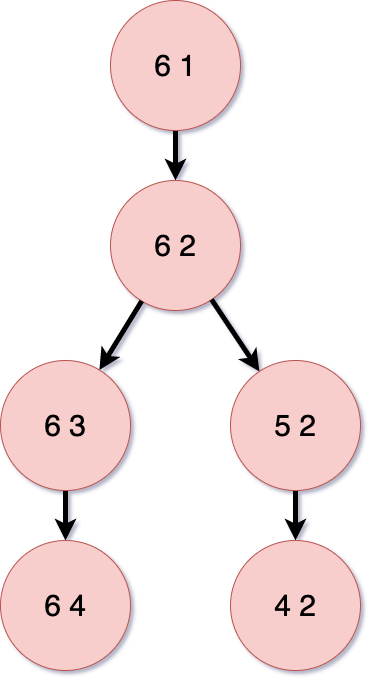
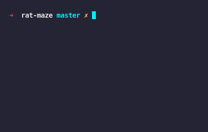

# Solving a maze with A*
The purpose of this code is to solve a provided maze using the A* search algorithm.
Before we start, I strongly recommend reading [this article](https://theory.stanford.edu/~amitp/GameProgramming/AStarComparison.html).

## Parsing the Maze
Here is an example of a maze:

```
#################################E###
###....#.....#......###...#...#...#.#
#.C.##...###...####.....#..##.#.##..#
#.#########.###....##.####.##.#.#..##
#.............##.######..#......#...#
##.##.#####.#..........C.##########.#
#S.......C..###.#.#.##..............#
#####################################
```
`#` - wall
`.` - path
`C` - cheese
`S` - start
`E` - end

We need to parse this to a graph, so we can apply the A* search to find the shortest path.

After split the columns and lines and saving the position of the start and the end, I created a collection with the paths from the beginning to the end.
The keys are equivalent to position in array, the beginning of the maze above would look like this:


## Finding the shortest path
Now with the graph, the start position and the goal, we just need to find the better solution. So we run through the graph, saving the visited positions and exploring the neighbours.
```
def find_shortest_path(graph, start, goal):
  explored = []
  queue = [[start]]

  if start == goal:
    raise Exception("Same node")

  while queue:
    path = queue.pop(0)
    node = path[-1]

    if node not in explored:
      neighbours = graph[node]

      for neighbour in neighbours:
        new_path = list(path)
        new_path.append(neighbour)
        queue.append(new_path)

        if neighbour == goal:
          return new_path
      explored.append(node)
```(python)

## Showing the result
After we find the best path, we just need tho show the result. In this case I just print on terminal the rat walking by.

